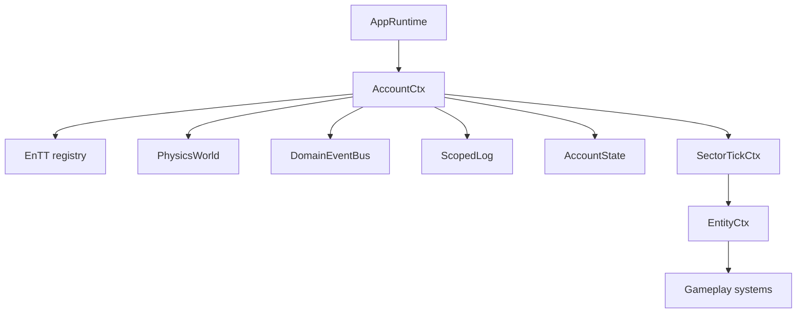

# Architecture

Hyperverse uses a deliberately small composition spine:

`AppRuntime` is the current composition root. It owns startup wiring, installs event handlers, pumps SDL input, advances the fixed timestep, and hands renderer-neutral snapshots to the renderer.

Persistent gameplay state lives in three places:

- EnTT components for entity state such as `ShipMotion`, `AsteroidBody`, `MiningDrone`, `RaiderShip`, `CargoBox`, and `ParticleCannonModel`.
- Explicit subsystem models such as `GameSessionModel`, `CargoEscortState`, and `CargoDispatchModel`.
- State-machine phase fields backed by Boost.Ext SML transition tables where transition logic is explicit.

Events are transient. They are processed each simulation tick and must not be used as storage.

## Fixed Simulation

`AppRuntime` accumulates real elapsed time into `FixedTimestep` and runs gameplay ticks at `UniverseClock::FixedTickSeconds`. Rendering may observe interpolation-oriented state, but gameplay logic should stay deterministic under representative timestep splits.

## Renderer Boundary

Gameplay exposes renderer-neutral positions, velocities, intensities, phases, and HUD snapshots. Dawn/WebGPU handles stay behind renderer code such as `DawnRenderer` and effect-specific renderer resources.
