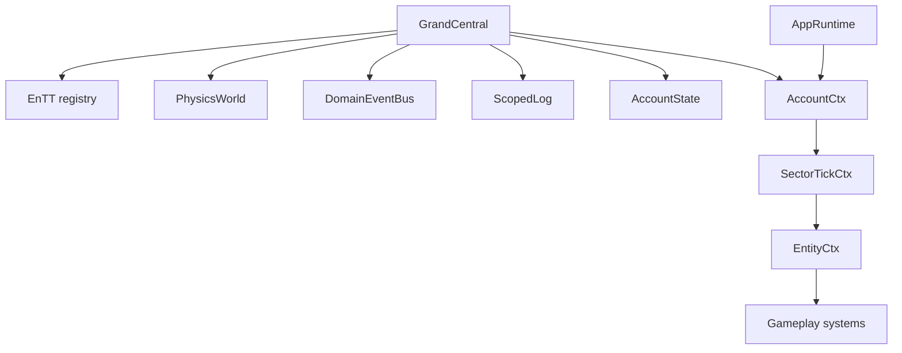

# Architecture

Hyperverse uses a deliberately small composition spine:

`GrandCentral` is the composition root. It owns account-wide runtime state and derives the first
typed context, `AccountCtx`. Startup code may know about `GrandCentral`; gameplay systems should
receive only the narrow context that describes their authority.

`AppRuntime` is an internal application loop built from `AccountCtx`. It installs event handlers,
pumps SDL input, advances the fixed timestep, and hands renderer-neutral snapshots to the renderer.
It should continue shrinking toward platform loop responsibilities as lifecycle behavior moves
behind typed contexts and event responders.

Persistent gameplay state lives in three places:

- EnTT components for entity state such as `ShipMotion`, `AsteroidBody`, `MiningDrone`, `RaiderShip`, `CargoBox`, and `ParticleCannonModel`.
- Explicit subsystem models such as `GameSessionModel`, `CargoEscortState`, and `CargoDispatchModel`.
- State-machine phase fields backed by Boost.Ext SML transition tables where transition logic is explicit.

Events are transient. They are processed each simulation tick and must not be used as storage.

## Sector Scale

The sector is intentionally independent of the browser or native window resolution. Gameplay
currently uses a fixed 9 by 9 grid of 1920x1080 reference screens, with wraparound distance
helpers keeping movement and targeting deterministic across sector edges.

## Fixed Simulation

`AppRuntime` accumulates real elapsed time into `FixedTimestep` and runs gameplay ticks at `UniverseClock::FixedTickSeconds`. The canonical simulation tick is 60 Hz. Rendering may observe interpolation-oriented state, but gameplay logic should stay deterministic under representative timestep splits.

## Renderer Boundary

Gameplay exposes renderer-neutral positions, velocities, intensities, phases, and HUD snapshots. Dawn/WebGPU handles stay behind renderer code such as `DawnRenderer` and effect-specific renderer resources.
