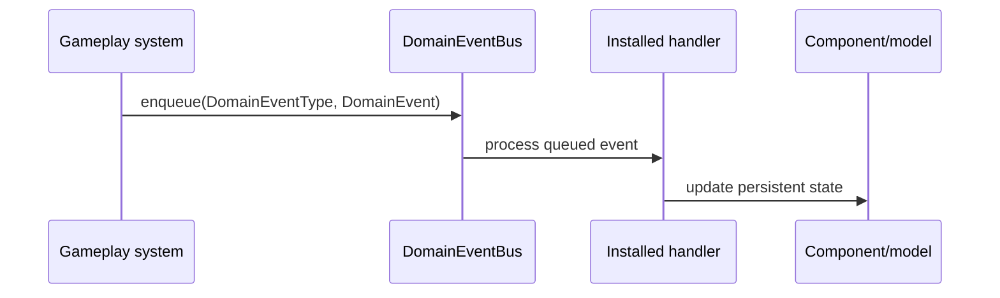
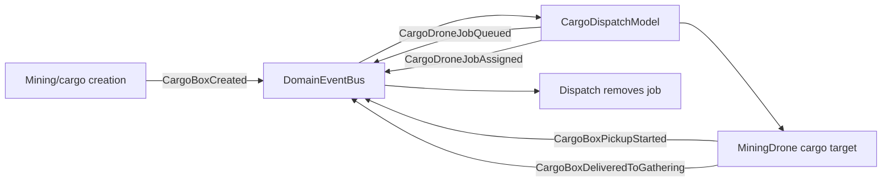

# Event Flow

Hyperverse uses `eventpp::EventQueue` through `DomainEventBus`.

```cpp
using DomainEventBus = eventpp::EventQueue<DomainEventType, void(const DomainEvent&)>;
```

Events are queued during gameplay updates and processed by the application loop. They carry facts such as "cargo box created", "particle impacted", or "cargo arrived at the extraction gate".



## Ownership Rules

- Event payloads are facts, not durable state.
- A listener may update components or subsystem models that it explicitly owns or was installed with.
- Event handlers are installed at composition boundaries such as `AppRuntime`.
- Gameplay code should accept `DomainEventBus&` or a narrow context that exposes it.
- Entity references in events must be treated as nullable and revalidated before component access.

## Current Handler Wiring

- `install_game_session_event_handlers` listens for contract lifecycle events.
- `install_cargo_dispatch_event_handlers` listens for cargo creation and delivery to assign drone jobs.
- `AppRuntime` listens for `CargoArrivedAtGate` to spawn combat raiders and display the extraction acceptance notice.

## Current Event Path Example


