# State Machines

Hyperverse models gameplay mode explicitly. SML-backed systems keep transition tables private and persist the public enum/model state in components or subsystem models.

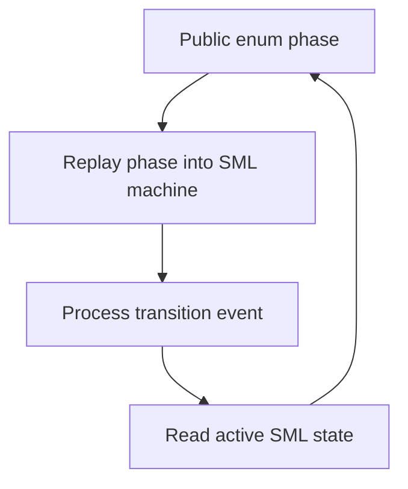

## SML-Backed Machines

| Model | Public phase | Transition owner | Purpose |
| --- | --- | --- | --- |
| `GameSessionModel` | `GameSessionPhase` | `src/game_session.cpp` | Moves between contract chooser and active round. |
| `CargoEscortState` | `CargoEscortPhase` | `src/cargo_escort.cpp` | Moves from mining to authorized extraction, escort, extraction, and completion. |
| `CargoExtractionModel` | `CargoExtractionPhase` | `src/cargo_extraction.cpp` | Owns extraction queue mode, active-box gate movement, active extraction, and completion. |
| `CargoBox` | `CargoBoxState` | `src/cargo_box.cpp` | Moves cargo pods through pickup, hauling, train, gate, extraction, detached, stolen, recovered, and lost states. |
| `GravitySlingModel` | `GravitySlingPhase` | `src/gravity_sling.cpp` | Moves the ship between free flight, engagement interpolation, active sling, and disengage reasons. |
| `MiningDrone` cargo mode | `MiningDronePhase` subset | `src/drone.cpp` | Moves cargo drones through unassigned, pickup, escorting, and delivered. |
| `MiningDrone` work mode | `MiningDronePhase` subset | `src/drone.cpp` | Moves non-cargo drones between idle formation, travelling to work, and mining. |
| `ParticleCannonModel` | `ParticleCannonPhase` | `src/projectile.cpp` | Moves a cannon between ready and cooldown. |
| `HomingMissileLauncherModel` | `HomingMissileLauncherPhase` | `src/projectile.cpp` | Moves the missile launcher between ready and cooldown. |
| `HomingMissile` | `HomingMissilePhase` | `src/projectile.cpp` | Moves each missile from ejected coast to ignited homing flight. |
| `RadarControlModel` | `RadarControlPhase`, `RadarFocus` | `src/radar_control.cpp` | Interprets target shoulder input, records mining/combat focus, emits radar target events, and blocks sloppy chord release. |
| `RaiderShip` phase | `RaiderPhase` | `src/raider.cpp` | Moves raiders through idle, approach, disruption, towing, and escaped phases. |
| `RaiderShip` task | `RaiderTask` | `src/raider.cpp` | Moves raiders between cargo theft, harassment, cover, and full aggression tasks. |
| `FlightInputMapper` | `ControlMapping` | `src/input.cpp` | Chooses keyboard or gamepad mapping based on the most recent observed input source. |

## Game Session

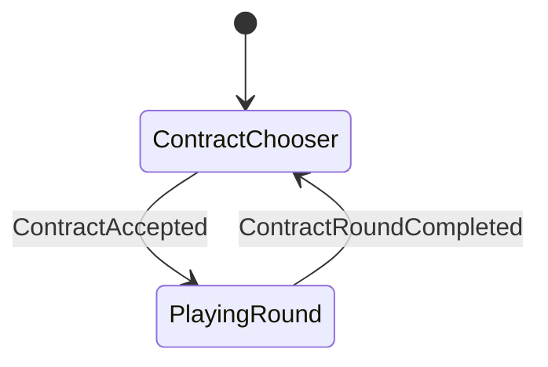

`accept_contract` and `complete_contract_round` enqueue events and update the local model immediately. Installed event handlers keep externally enqueued contract events in sync with `GameSessionModel`.

## Cargo Escort

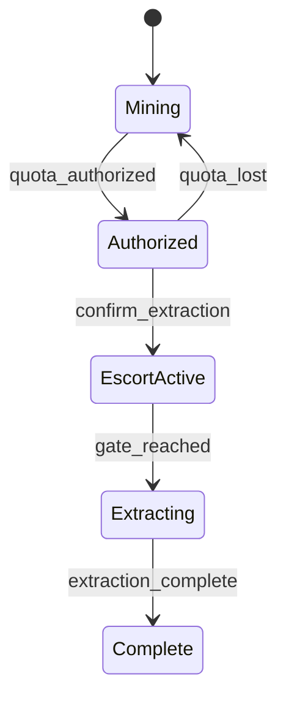

`CargoEscortState` emits `CargoEscortStarted` when the player confirms extraction and `CargoArrivedAtGate` when the cargo reaches the gate.

## Drone Cargo Work

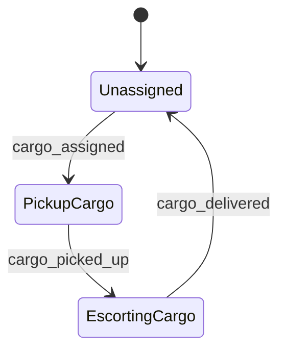

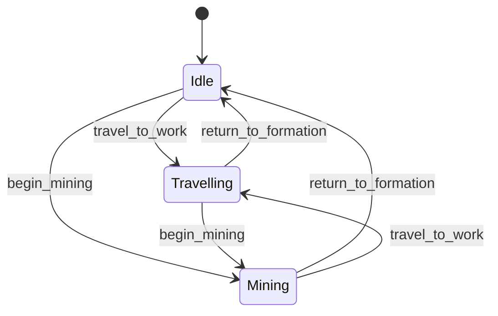

The durable component remains `MiningDrone`. The cargo FSM owns only the cargo hauling subset. A
separate small work FSM owns the normal idle/travelling/mining subset so cargo delivery can preempt
work without collapsing all drone behavior into one large machine.

## Cargo Extraction

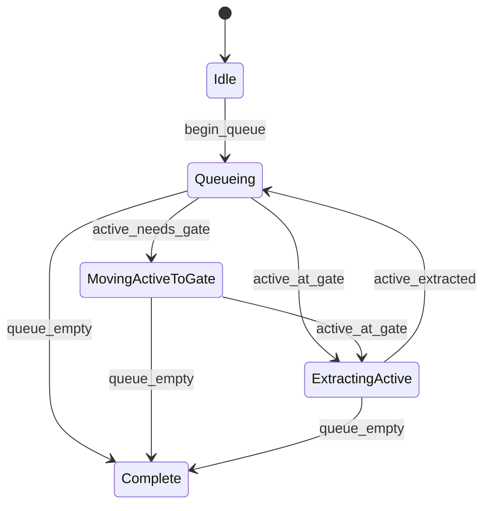

`CargoExtractionModel` is persistent subsystem state owned by the app runtime. It records the
extraction phase and current active box. Cargo box lifecycle still belongs to `CargoBox`; extraction
requests named cargo-box transitions such as `SendToGate`, `StartExtraction`, and
`FinishExtraction`.

## Cargo Box

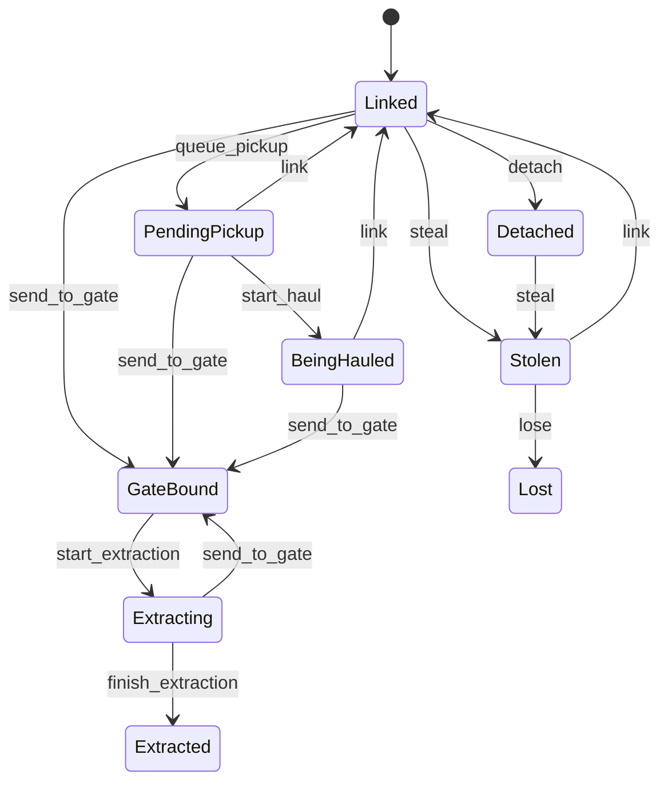

`CargoBox::state` is durable entity state. Production systems mutate it through
`transition_cargo_box`, which replays the durable state into the private SML machine, applies one
transition, writes the public state back, and emits `CargoBoxStateChanged` when the state changed.

## Particle Cannon

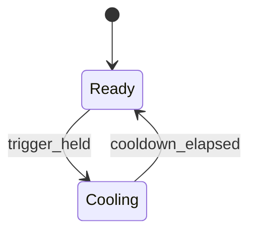

Player, drone, and raider cannons share the same model. Tuning changes the cooldown interval for each owner.

## Input Mapping

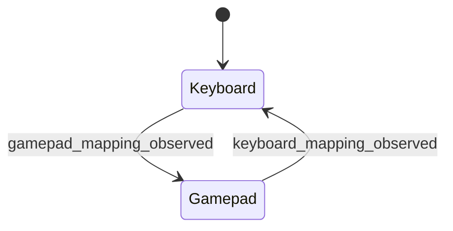

Raw SDL input is mapped into semantic intent once per simulation tick. Edge-triggered actions such as confirm, boost, Gravity Sling, particle fire, and missile fire are computed by comparing the current raw frame with the previous raw frame.

Radar target shoulder behavior is intentionally not part of the broad input-mapping FSM. The input
mapper exposes shoulder state, and `RadarControlModel` owns the specific radar-control transitions.
Asteroid and combat radar maintain separate persisted target-order lists; the radar-control FSM
only emits the command that tells the relevant lock to consume its own list.

## Radar Control

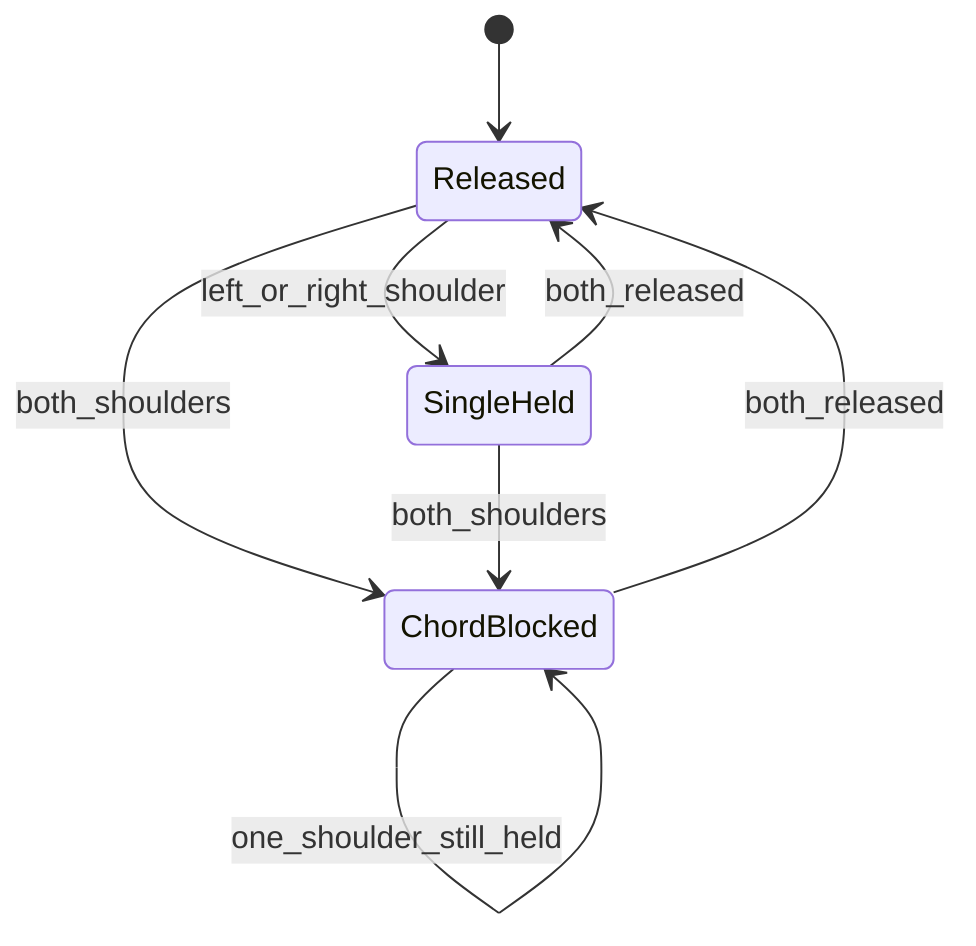

Entering `SingleHeld` from `Released` emits either `MiningTargetCycleRequested` or
`EnemyTargetCycleRequested`. Entering `ChordBlocked` emits `RadarTargetsCleared`. While
`ChordBlocked`, one shoulder remaining down after a chord release is ignored until both shoulders
are fully released.

## Raiders

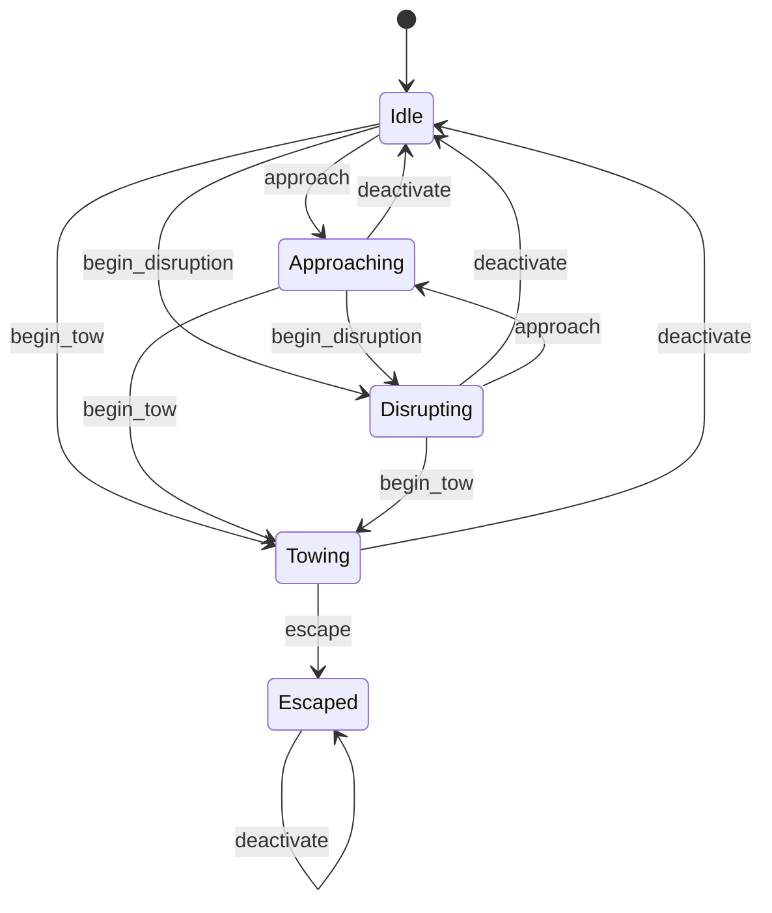

`RaiderPhase` is mutated through `transition_raider_phase`; `RaiderTask` is mutated through
`transition_raider_task`. These owners emit `RaiderPhaseChanged` and `RaiderTaskChanged`. Raider
steering and orbit movement remain procedural logic around those transition owners.

## Explicit Enum State Without SML

Some systems currently use explicit phase enums without SML transition tables:

- `EngineTrailEngine` uses `EngineSourcePhase` for dormant, active, and decaying nozzle glow.
- `TargetLockModel` uses `TargetLockPhase`.

These are still first-class state models. When transitions become complex, add a private SML transition table and keep the public enum/model as the durable state.

## Gravity Sling

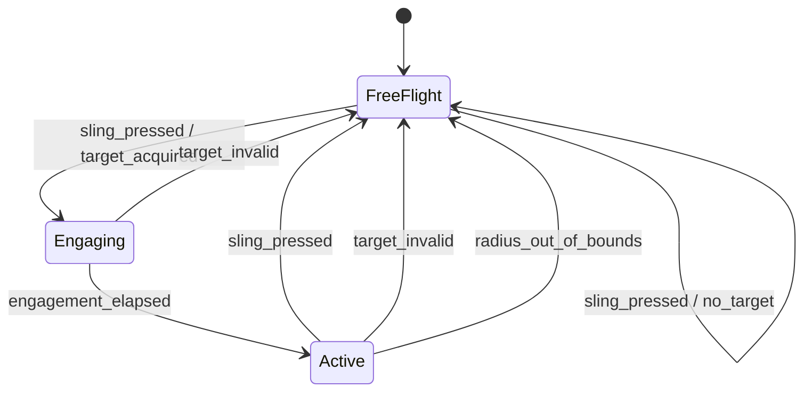

`GravitySlingModel` is intentionally renderer-neutral. The SML transition owner controls
`GravitySlingPhase` and `GravitySlingDisengageReason`; the model records the target entity,
constrained radius, local angle, relative angular velocity, entry velocity, current world velocity,
and the last disengage reason.

The current mechanic does not couple player bearing to asteroid visual tumble. It treats the target
as moving terrain with a stable radial constraint: player movement input changes relative orbital
velocity, and release computes a free-flight velocity from target translation plus the player-shaped
orbital component.
