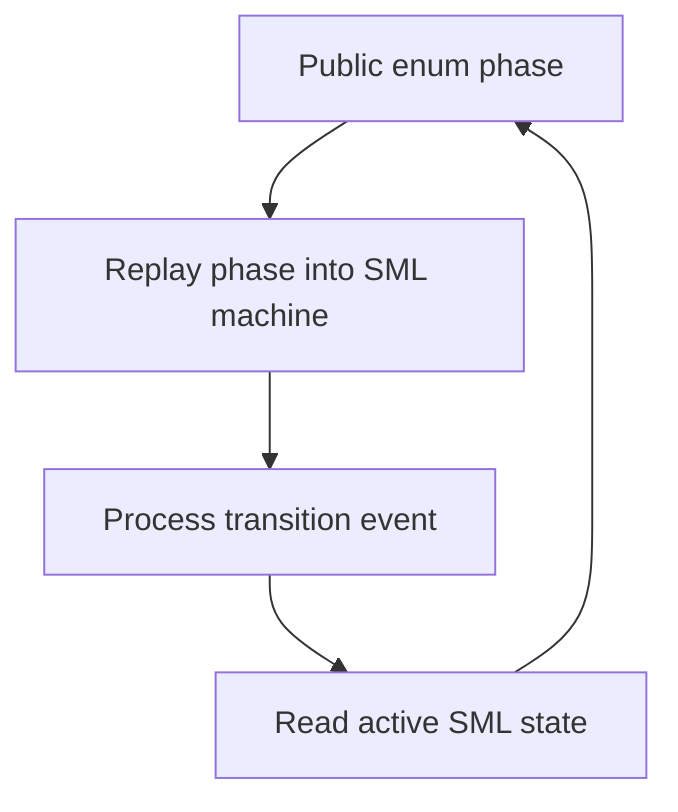
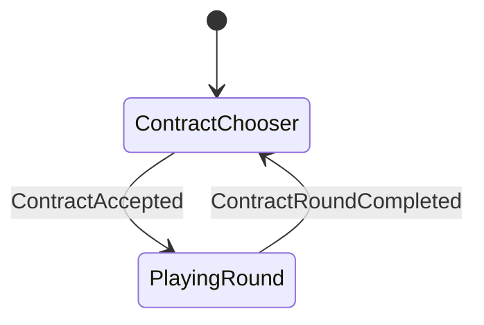
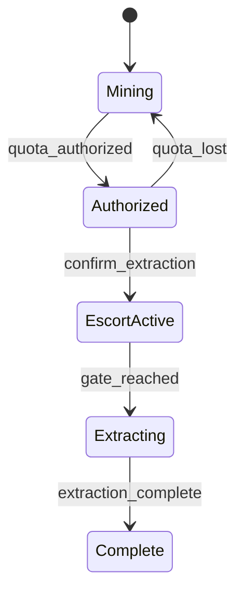
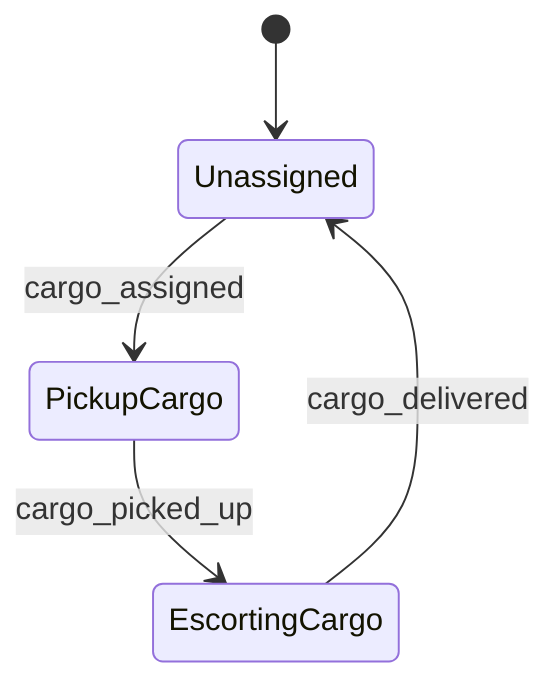
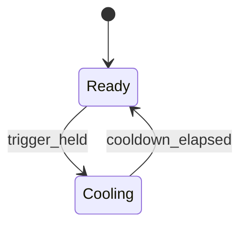
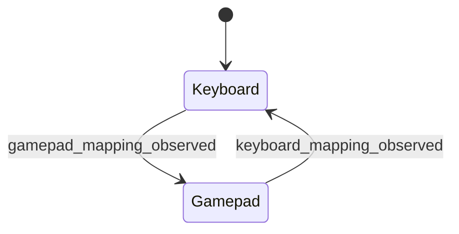

# State Machines

Hyperverse models gameplay mode explicitly. SML-backed systems keep transition tables private and persist the public enum/model state in components or subsystem models.

## SML-Backed Machines

| Model | Public phase | Transition owner | Purpose |
| --- | --- | --- | --- |
| `GameSessionModel` | `GameSessionPhase` | `src/game_session.cpp` | Moves between contract chooser and active round. |
| `CargoEscortState` | `CargoEscortPhase` | `src/cargo_escort.cpp` | Moves from mining to authorized extraction, escort, extraction, and completion. |
| `MiningDrone` cargo mode | `MiningDronePhase` subset | `src/drone.cpp` | Moves cargo drones through unassigned, pickup, escorting, and delivered. |
| `ParticleCannonModel` | `ParticleCannonPhase` | `src/projectile.cpp` | Moves a cannon between ready and cooldown. |
| `FlightInputMapper` | `ControlMapping` | `src/input.cpp` | Chooses keyboard or gamepad mapping based on the most recent observed input source. |

## Game Session

`accept_contract` and `complete_contract_round` enqueue events and update the local model immediately. Installed event handlers keep externally enqueued contract events in sync with `GameSessionModel`.

## Cargo Escort

`CargoEscortState` emits `CargoEscortStarted` when the player confirms extraction and `CargoArrivedAtGate` when the cargo reaches the gate.

## Drone Cargo Work

The durable component remains `MiningDrone`. The cargo FSM owns only the cargo hauling subset; mining, travelling, and idle formation behavior are still explicit update logic around that machine.

## Particle Cannon

Player, drone, and raider cannons share the same model. Tuning changes the cooldown interval for each owner.

## Input Mapping

Raw SDL input is mapped into semantic intent once per frame. Edge-triggered actions such as confirm, boost, Gravity Sling, and particle fire are computed by comparing the current raw frame with the previous raw frame.

## Explicit Enum State Without SML

Some systems currently use explicit phase enums without SML transition tables:

- `GravitySlingModel` uses `GravitySlingPhase` and `GravitySlingDisengageReason`.
- `TargetLockModel` uses `TargetLockPhase`.
- `RaiderShip` uses `RaiderPhase`, `RaiderRole`, and `RaiderTask`.
- `MiningDrone` uses `MiningDronePhase` outside the cargo-hauling subset.

These are still first-class state models. When transitions become complex, add a private SML transition table and keep the public enum/model as the durable state.
